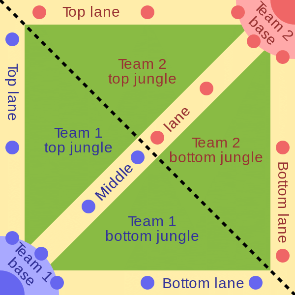
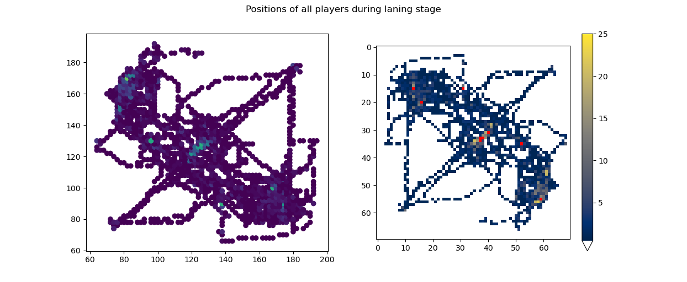
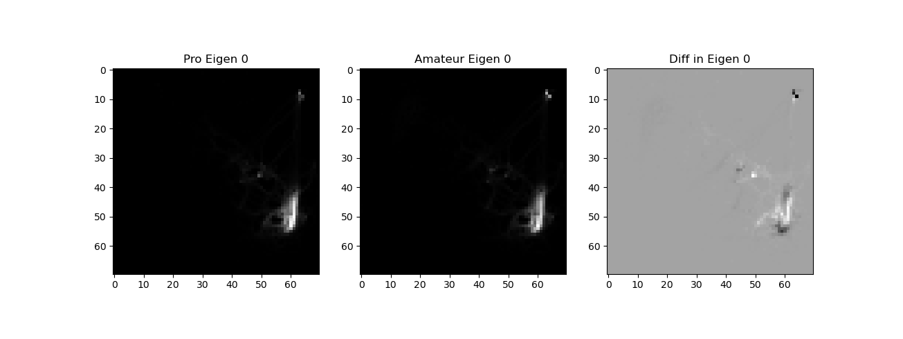
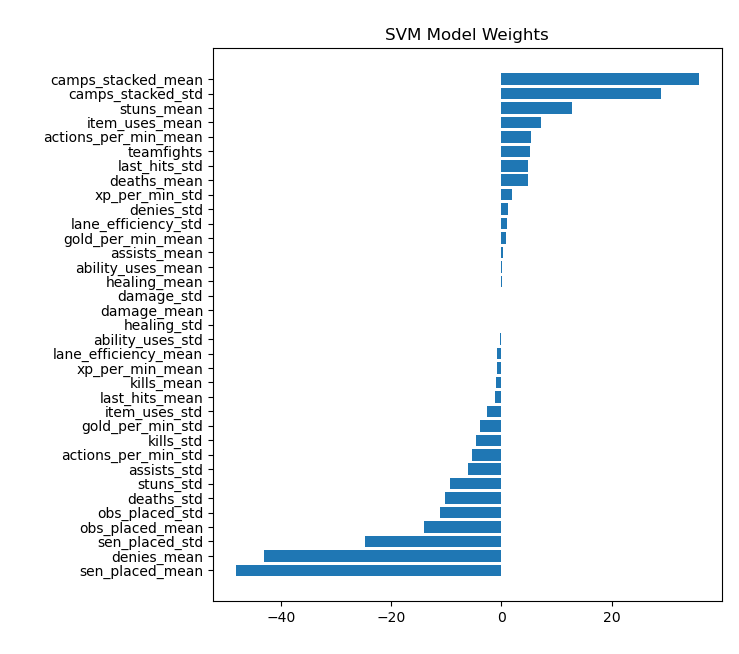
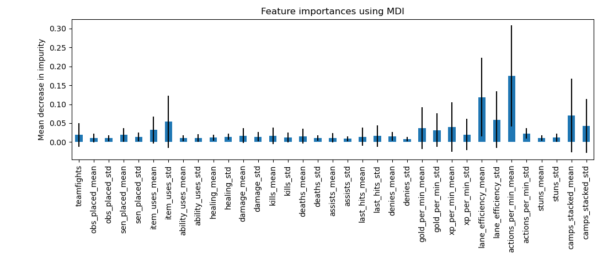

# Dota 2: Pro or Pub?
## Identifying Differences Between Professional and Amateur Matches Using Machine Learning

## Overview

This project investigates how professional and amateur Dota 2 matches differ, using
interpretable machine learning models and spatial analysis of early-game player behavior.

Rather than focusing on predicting match outcomes, the goal is **interpretability**:
to identify *which aspects of gameplay most clearly separate professionals from amateurs*
and to extract actionable insights that lower-skill players can use to improve.

---

## Problem Statement

A common recommendation for new or improving Dota 2 players is to “watch the pros and learn
from them.” In practice, it is often unclear **which behaviors actually distinguish professional
play** from high-volume public matchmaking.

This project addresses two questions:

- Can we accurately classify a match as **professional** or **amateur**?
- Which **features and behaviors** most strongly differentiate professional play?

---

## Data Source

Match data was collected from the **OpenDota API**, using:

- 1,000 professional matches
- 1,000 public (amateur) matches

Filtering criteria:
- Match duration ≥ 20 minutes
- No player abandons

Each match was converted into a structured feature vector containing **35 numeric features**
plus a class label.

---

## Domain Context: Map Structure and Laning Phase

To ground the analysis, Figures 1 and 2 illustrate the general MOBA map layout and the
current Dota 2 map used during data collection.

  
  

*Figure 1 (left): Typical MOBA map layout.  
Figure 2 (right): Dota 2 map as of patch 7.33.*

The **laning phase** (first ~10 minutes) is especially important, as early positioning,
resource collection, and rotations strongly influence match trajectory.

---

## Positional Data Representation

OpenDota provides player position traces during the laning phase.
Raw coordinate samples were mapped into spatial matrices representing player occupancy.

  

*Figure 3: Raw positional traces (left) and aggregated spatial heatmap (right).*

These matrices form the basis for spatial analysis using Principal Component Analysis (PCA).

---

## Spatial Analysis: PCA of Laning Positions

### Principal Components by Role

Player position matrices were separated by estimated role, flattened, and analyzed using PCA.
This produces “eigen-position” maps capturing dominant spatial behaviors.

  

*Figure 6: Principal components for Dire offlane positioning (professional, amateur, and difference).*

Key spatial differences:
- Professionals occupy **tighter regions around creep waves**
- Professionals roam to mid lane more frequently
- Amateurs exhibit broader, less focused spatial dispersion

Subsequent components reinforce these patterns, including more frequent fallback positioning
under tower protection by professional players.

---

## Feature Engineering

### Match-Level and Aggregated Player Statistics

Features include both match-level metrics and player-level statistics aggregated across
the ten players in each match (mean and standard deviation), such as:

- Camps stacked
- Lane efficiency
- Actions per minute
- Sentry and observer placement
- Teamfights
- Gold, XP, and damage metrics

Aggregation was used to preserve interpretability while keeping the feature space tractable.

---

## Methodology

### Match Classification

Two interpretable classifiers were trained:

- **Linear Support Vector Machine (SVM)**
- **Random Forest**

These models were chosen because they:
- Preserve the original feature space
- Allow direct inspection of feature importance

**Classification Performance**
- Linear SVM accuracy: **91.7%**
- Random Forest accuracy: **93.6%**

---

## Feature Importance Analysis

### Linear SVM Weights

The learned weights of the linear SVM provide a direct measure of feature influence.

  

*Figure 4: Linear SVM feature weights. Positive values correlate with professional matches;
negative values correlate with amateur matches.*

Key observations:
- **Camp stacking** and **lane efficiency** strongly correlate with professional play
- **Sentry placement frequency** correlates with amateur play
- Raw metrics like gold per minute and damage are comparatively uninformative

---

### Random Forest Feature Importance

Feature importance was also evaluated using mean decrease in impurity (MDI).

  

*Figure 5: Random Forest feature importance with variance across trees.*

Highly influential features:
- Actions per minute
- Lane efficiency

The variance across trees suggests multiple viable behavioral strategies within professional play.

---

## Results Summary

| Component | Insight |
|--------|--------|
| Classification | Pro vs amateur matches are highly distinguishable |
| Feature importance | Macro-level decisions dominate raw mechanics |
| Spatial PCA | Professionals exhibit disciplined lane control |
| Interpretability | Results translate directly to actionable advice |

---

## Conclusion

Professional Dota 2 play is distinguished less by raw output (damage, gold) and more by
**decision quality**, **lane discipline**, and **map efficiency**.

By combining interpretable classifiers with spatial analysis, this project identifies
specific behaviors amateurs can target for improvement—such as effective camp stacking,
lane positioning, and selective roaming.

---

## Future Work

Potential extensions include:
- Incorporating hero selection and matchups
- Role-specific classifiers
- Temporal modeling beyond the laning phase
- Clustering spatial behaviors instead of PCA

---

## Tech Stack

- Python
- NumPy / pandas
- scikit-learn
- Matplotlib
- OpenDota API

---

## Academic Context

Completed as a term project for **ISyE 6740 – Data Mining & Statistical Learning**  
Georgia Institute of Technology
